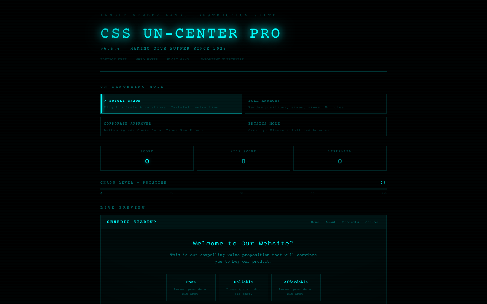

# :cyclone: CSS Uncenter

**The anti-centering tool — un-center every perfectly aligned element with physics and chaos.**

Built by [Arnold Wender](https://arnoldwender.com)

[:rocket: Live Demo](https://css-uncenter.netlify.app)



## Features

- 4 un-centering modes — Drift, Earthquake, Gravity, and Full Chaos
- Live preview of your beautifully destroyed layouts
- Before/after comparison slider to admire the damage
- CSS output panel — copy the cursed CSS for your own projects
- Score system that rewards maximum visual destruction
- Hidden chaos panel with secret advanced controls
- Physics-based animations for realistic element displacement
- Confetti when you achieve peak un-centeredness

## Tech Stack

- **React 18** + **TypeScript**
- **Vite** — lightning-fast dev server and builds
- **Tailwind CSS** — utility-first styling
- **Framer Motion** — physics-based animations and transitions
- **canvas-confetti** — celebration effects
- **html2canvas** — before/after screenshot export
- **Lucide React** — icon set

## Getting Started

```bash
# Clone the repository
git clone https://github.com/arnoldwender/css-uncenter.git
cd css-uncenter

# Install dependencies
npm install

# Start development server
npm run dev
```

Open [http://localhost:5173](http://localhost:5173) in your browser.

## Build

```bash
npm run build
npm run preview
```

## Contributing

Contributions are welcome! Check out [CONTRIBUTING.md](CONTRIBUTING.md) for guidelines on how to get involved.

## License

This project is licensed under the [MIT License](LICENSE).
